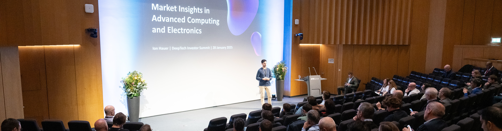

# Ion Hauer

Ion is a Principal at APEX Ventures, where he invests venture capital in European early-stage deep tech startups working on advanced computing (semiconductors, photonics, quantum, AI).

He brings over 14 years of experience at the intersection of technological breakthroughs and financial capital. He has a PhD in quantum physics from Heidelberg University and previously held positions as Chief Operating Officer at GlassDollar, VP Corporate Venturing at Bosch and Management Consultant at Oliver Wyman, while actively angel investing and mentoring startups for many years.

A passionate technical and rescue diver, Ion is based in Munich, Germany, with his wife and son.

# Content

## Articles

🗞️ [Quantum's path to commercial viability with APEX Ventures' Ion Hauer](https://infinitefrontiers.io/conversations/quantums-path-to-commercial-viability-with-apex-ventures-ion-hauer/) (Infinite Frontiers, 22 Aug 2025)

🗞️ [2025 Semiconductor Trends: A Venture Capital Perspective](https://apexventures.substack.com/p/2025-semiconductor-trends-a-venture) (APEX Ventures Substack, 11 Jun 2025)

🗞️ [Venture View: Ion Hauer from APEX Ventures on how neutral atoms can deliver on quantum’s commercial promises](https://biforesight.com/quantum/venture-view-ion-hauer-from-apex-ventures-on-how-neutral-atoms-can-deliver-on-quantums-commercial-promises/) (BI Foresight, 16 Oct 2024)

🗞️ [Europe needs more scientists in VC to become a deeptech powerhouse](https://tech.eu/2024/02/10/europe-needs-more-scientists-in-vc-to-become-a-deep-tech-powerhouse/) (Tech.eu, 10 Feb 2024)

🗞️ [Welcome to Dr. Ion Hauer, Principal at APEX Ventures](https://medium.com/apex-ventures/welcome-to-dr-ion-hauer-principal-at-apex-ventures-537450fcf030) (APEX Ventures Medium, 2 Aug 2023)

## Commentaries

🗞️ [Ion Hauer of APEX Ventures: Balancing AI with Human Intuition](https://www.conversationalainews.com/ion-hauer-of-apex-ventures-balancing-ai-with-human-intuition/) (Conversational AI, 11 Jun 2025)

🗞️ [11 future of compute startups to watch, according to VCs](https://sifted.eu/articles/11-future-of-compute-startups-to-watch) (Sifted, 21 Apr 2025)

🗞️ [AI experts available to provide comment to journalists](https://www.responsesource.com/blog/ai-experts-available-to-provide-comment-to-journalists/) (ResponseSource, 25 Feb 2025)

🗞️ [Draghi report sounds alarm on Europe's competitive decline](https://tech.eu/2024/09/13/draghi-report-sounds-alarm-on-europes-competitive-decline/) (Tech.eu, 13 Sep 2024)

🗞️ [More qubits, more money, more mergers: Quantum predictions for 2024](https://sifted.eu/articles/quantum-predictions-2024) (Sifted, 27 Dec 2023)

## Talks

🎤 Recent Trends in Next-Gen Computing Investments (HHL SpinLab Investors Day, 18 Jun 2025, Leipzig)

🎤 Pilots that Attract Investment: Key factors for investment success (Build Better Hardwave Vol. 7, 3 Jun 2025, Munich)

🎤 The Deep Tech Transfer Playbook: Transforming University IP into Successful Ventues (Deep Tech Momentum, 14 May 2025, Berlin)

🎤 VC Perspective on Semiconductor Trends and Investment Opportunities (Applied Deep Tech Fest, 7 May 2025, Stuttgart)

🎤 Market Insights in Advanced Computing and Electronics (ETH DeepTech Investor Summit, 28 Jan 2025, Zurich)

🎤 [Investment Criteria and Key Focus Areas of Deep Tech Investors](https://www.tum-venture-labs.de/events/quantum-founders-meet-up-expert-session/) (TUM Venture Lab Quantum Founder's Meet-up, 6 Feb 2024, Munich)

## Panels

🎤 Capital, Transfer, Industry — What's Really Holding Us Back? (Applied Deep Tech Fest, 7 May 2025, Stuttgart)

🎤 [Scaling Up: The Future of European Venture Capital](https://www.1e9.community/festival-der-zukunft/programm/2024/scaling-up%3A-the-future-of-european-venture-capital) (Festival der Zukunft, 27 Jun 2024, Munich)

🎤 Quantum Life Sciences and Venture Capital (3rd Nordic Quantum Life Science Roundtable, 15 Nov 2023, Helsinki)

🎤 Industrial Application of Quantum Technologies (Forum Schlüsseltechnologien, 13 Nov 2023, Vienna)

🎤 [Strategies for Investing in Deep Tech and Quantum](https://www.youtube.com/live/bNaCBaeWlHY?si=BKwJBbPRVFj3sREA&t=3288) (invest.austria 2023 conference, 7 Nov 2023, Vienna)

🎤 European Deeptech Innovation — Just an illusion? (QBN Quantum Industry Summit 2023, 11 Oct 2023, Stuttgart)

🎤 [Learning from Startups: Methods, Mindset & Entrepreneurship in Corporations](https://www.dygitized.de/speaker/dr-ion-hauer/) (DYGITIZED, 3 Nov 2020, Munich)

## Podcasts

🎙️ [Venturing Beyond: Quantum Computing's Frontier Explored by a VC](https://www.youtube.com/watch?v=0PjrATWVxF0) (Understanding VC, 15 Aug 2023)

🎙️ [Investing in Deep Tech](https://www.youtube.com/watch?v=rCEue4RGtVk) (The Leadership Lab with DeepRec.ai, 31 Jul 2023)

# Experience

🚀 **Principal** at [APEX Ventures](https://www.apex.ventures/)

🎓 **PhD in quantum physics** from [Heidelberg University](https://www.uni-heidelberg.de/en)

🏠 **Managing Director** at [Hauer Ventures](https://www.hauerventures.com/)

👨‍🚒 **Startup Mentor** at [Start2 Group](https://www.start2.group), [Techstars](https://www.techstars.com/), and others

👨🏻‍🏫 Former **Lecturer** at [Munich Business School](https://www.munich-business-school.de/en)

🙋🏻‍♂️ Former **Chief Operating Officer** at [GlassDollar](https://www.glassdollar.com/)

💂‍♀️ Former **VP Corporate Venturing** at [Bosch](https://www.bosch.com/) ([BSH Startup Kitchen](https://www.bshstartupkitchen.com/))

💼 Former **Management Consultant** at [Oliver Wyman](https://www.oliverwyman.com/)

# Interests

🐠 **Scuba Diver** at [TDI](https://www.tdisdi.com/) (Decompression Diver) and [PADI](https://www.padi.com/) (Rescue Diver)

🦊 **Philanthropist** supporting [PETA](https://www.peta.org), [Greenpeace](https://www.greenpeace.org), [Welthungerhilfe](https://www.welthungerhilfe.org), [Amnesty International](https://www.amnesty.org/), [PLAN International](https://plan-international.org)

🏃🏻‍♂️ **Runner** at [Munich Marathon](https://www.muenchenmarathon.de), [Wings for Life World Run](https://www.wingsforlifeworldrun.com), [Spartan Race](https://www.spartan.com), and others

♠️ **Poker Player** at [GGPoker](https://ggpoker.com)

♟️ **Chess Player** at [Chess.com](https://www.chess.com)

🧑🏻‍🚀 **Aspiring Astronaut** at [ESA](https://www.esa.int)

🎮 **Gamer** since 1992 (PC, PlayStation, Quest)

# Press kit

Main portrait: [square version](ion_hauer_main_square.jpg)

Alternative portrait: [square version](ion_hauer_alternative_square.jpg), [landscape version](ion_hauer_alternative_landscape.jpg)

Speaking images: [version 1](ion_hauer_speaking_1.jpg), [version 2](ion_hauer_speaking_2.jpg), [version 3](ion_hauer_speaking_3.jpg), [version 4](ion_hauer_speaking_4.jpg), [version 5](ion_hauer_speaking_5.jpg), [version 6](ion_hauer_speaking_6.jpg)

# Contact

[LinkedIn](https://www.linkedin.com/in/ionhauer/) &#124; [X](https://x.com/ionhauer)

&copy; 2025 Ion Hauer. All rights reserved.
